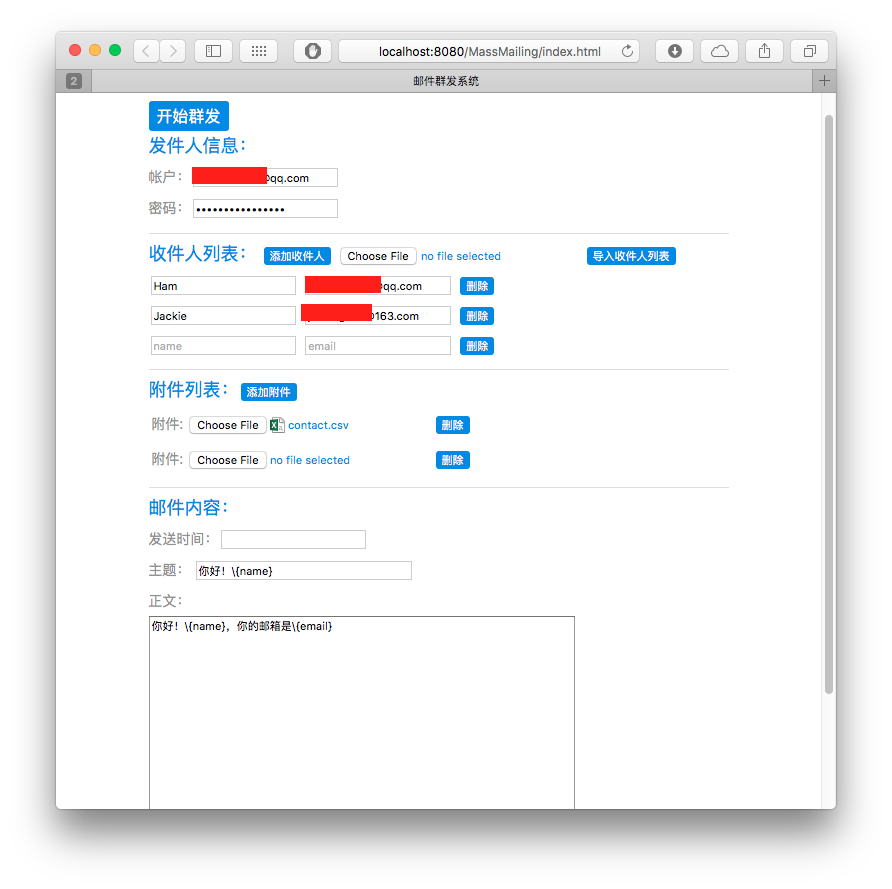

#Mass Mailing

a open-source mass mailing web application implemented in Java

##General

* support QQ mail,163,sina.com,sina.cn (need SMTP enabled)
* support CSV contact file import
* support attachment
* support mail content template

##Snapshot

##About Mail Template

* \\{name} will be replaced with the receiver's name
* \\{email} will be replaced with the receiver's email
* \\\\{name} will be replaced with "\\{name}"
* \\\\{email} will be replaced with "\\{email}"